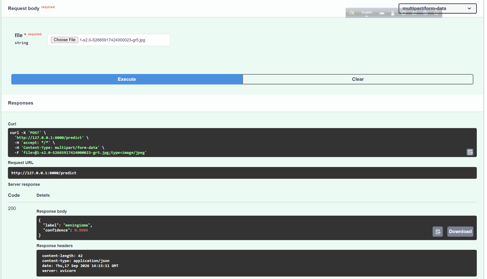
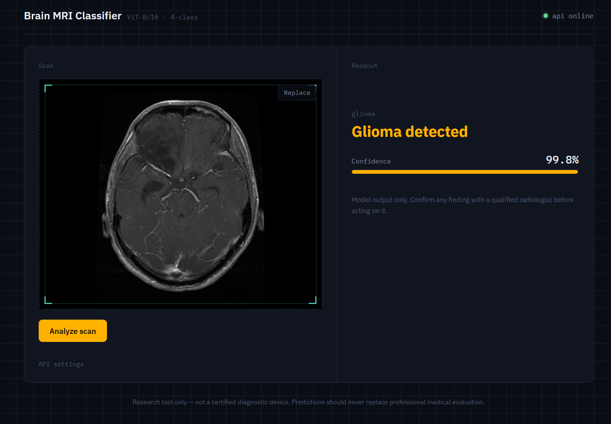
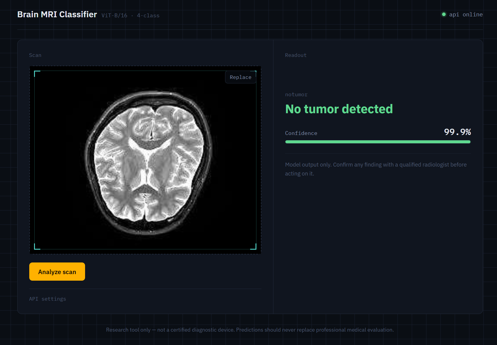

# Brain Tumor MRI Classifier

## Overview

This project fine-tunes a Vision Transformer (ViT) to classify brain MRI scans into four categories — glioma, meningioma, pituitary tumor, or no tumor — and serves the trained model through a FastAPI inference API. Upload an MRI image to the `/predict` endpoint and get back a predicted class with a confidence score.

## Model

- **Architecture:** `google/vit-base-patch16-224` (fine-tuned)
- **Dataset:** [Brain Tumor MRI Dataset](https://www.kaggle.com/datasets/masoudnickparvar/brain-tumor-mri-dataset) (Kaggle)
- **Classes:**
  | Class | Description |
  |-------|-------------|
  | `glioma` | Tumor arising from glial (supportive) cells of the brain or spinal cord |
  | `meningioma` | Tumor arising from the meninges, the membranes surrounding the brain and spinal cord |
  | `pituitary` | Tumor arising in the pituitary gland at the base of the brain |
  | `notumor` | No tumor present in the scan |
- **Test Accuracy:** `[your result]` <!-- TODO: fill in the final test accuracy printed by the training notebook -->
- **Epochs:** 6

## API Endpoints

| Method | Endpoint | Description |
|--------|----------|-------------|
| GET | `/health` | Server status and model info |
| POST | `/predict` | Upload MRI image, get prediction |

### `GET /health`

**Input:** none

**Output:**
```json
{
  "status": "ok",
  "model": "ViT model fine-tuned to detect brain tumors in MRI scans"
}
```

### `POST /predict`

**Input:** `multipart/form-data` with a single field `file` — the MRI image to classify (JPEG/PNG).

```bash
curl -X POST "http://localhost:8000/predict" \
  -H "accept: application/json" \
  -F "file=@sample_scan.jpg"
```

**Output:**
```json
{
  "label": "meningioma",
  "confidence": 0.9989
}
```

| Status | Meaning |
|--------|---------|
| `200` | Prediction succeeded |
| `400` | Uploaded file is not an image |
| `500` | Unexpected error during inference |

## Screenshots

### Swagger UI



### Graphical UI





## Installation

```bash
git clone [your-repo-url]
cd brain-tumor-classifier
pip install -r requirements.txt
```

Then create an `artifacts/` folder next to `predictor.py` containing `vit_brain_tumor.pt` and `class_names.json`.

## Run

```bash
fastapi dev main.py
# Open http://localhost:8000/docs
```

> If `fastapi dev` isn't available, install the CLI extras (`pip install "fastapi[standard]"`), or run with `uvicorn main:app --reload` instead.

## Technologies Used

- Python
- PyTorch, Hugging Face Transformers
- FastAPI
- Pillow